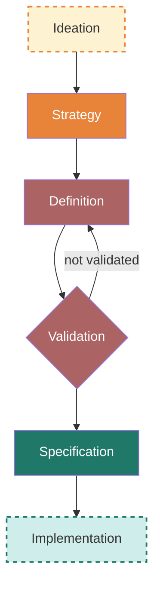

The goal of the apidays public API is **to offer the best possible experience to attendees before, during, and after a conference**.

I'm following my API Product Playbook, covering the following steps:

# Contributing

At this point I'm interested in interviewing potential consumers of the apidays public API. If you're interested in contributing as an interviewee, please open an "API product discovery interview" issue so I can follow up and schedule an interview with you.
